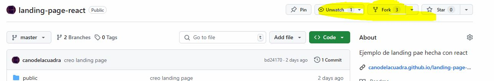

# Landing page en React
Es una simple landing page hecha por React

## Guía de instalación
1. Hacer un fork y/o clonar la app [repo](https://github.com/davidhg2000/landing-page-react.git)

Si hacemos un fork no es necesario añadir un remoto  (porque es nuestro repositorio) y 
no hacemos ``git init`` a no ser que queramos reiniciar el proyecto 

2. Instalamos dependencias de node 


````shell
npm install
````
3. Arrancamos el servidor del pruebas 
````shell
npm run dev
````
y saldrá por consola
````
> landing-page-distribuida@0.0.0 dev
> vite


  VITE v6.3.3  ready in 851 ms

  ➜  Local:   http://localhost:5173/
  ➜  Network: use --host to expose
````
4. Hacemos las modificaciones pertinentes
5. Hacemos un commit 
```` shell
git add --all 
git commit -m "nombre del commit"
````
6. Subimos los cambios al repositorio
````shell
git push origin master
````